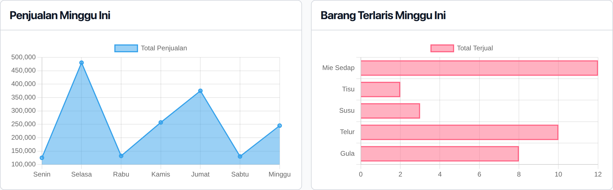

Grafik toko adalah informasi statistik toko yang disajikan dalam bentuk visual.

Grafik toko hanya bisa dilihat oleh pengguna Admin dan Manager.

Ada dua grafik yang ditampilkan di dashboard:

## 1. Grafik Penjualan Mingguan

Menampilkan data total pemasukan penjualan per hari dalam satu minggu.

Bermanfaat untuk melihat alur hari dengan penjualan paling laris dan paling tidak laris dalam satu minggu.

## 2. Grafik Barang Terlaris Mingguan

Menampilkan daftar barang diurutkan berdasarkan yang paling banyak terjual dalam satu minggu.

Bermanfaat untuk mengetahui barang apa saja yang paling laris dalam satu minggu.
