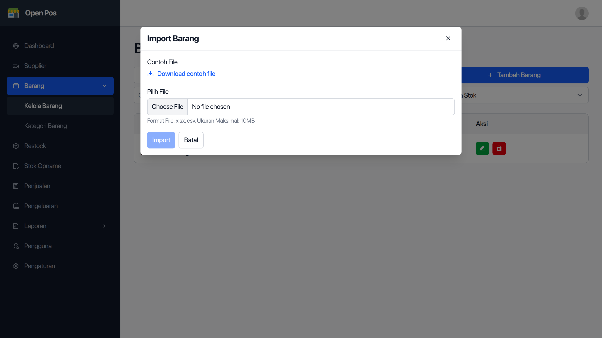

Import dan export barang adalah fitur untuk memudahkan dalam mengelola data barang di aplikasi OpenPos.

## Cara Import Barang

Import barang berfungsi untuk memasukkan banyak barang sekaligus ke aplikasi melalui sebuah file `.csv`.

File `.csv` adalah file yang mirip excel/spreadsheet. File ini bisa dibuat dari file excel yang disimpan dengan format `.csv`.

Di dalam file `.csv` barang, baris bertama harus ada kolom-kolom berikut:

1. `name`, nama barang.
2. `category`, kategori barang.
3. `barcode`, barcode barang.
4. `price`, harga jual barang.
5. `purchase_price`, harga beli barang.
6. `stock`, stok barang.

Contoh isi file `.csv` barang:

```csv
name,category,barcode,price,purchase_price,stock,min_stock
"Beras Ramos 5kg","Sembako",899100100001,72000,65000,5,10
```

Setelah file `.csv` barang sudah siap, buka halaman `Barang` di menu samping kiri.

Klik tombol `Import Barang`, maka akan muncul _popup_ untuk mengupload file `.csv` barang.



Masukkan file `.csv` barang lalau tekan tombol `Import`.

Tunggu hingga selesai. Setelah selesai, akan muncul notifikasi berhasil import, dan barang bisa dilihat di daftar barang.

## Cara Export Barang

Export barang berfungsi untuk membuat sebuah file `.csv` berisi daftar barang dalam aplikasi.

Caranya masih di halaman `Barang`, klik tombol `Export Barang`, tunggu hinggal selesai.

Setelah selesai, file `.csv` barang hasil export bisa disimpan ke komputer Anda.
