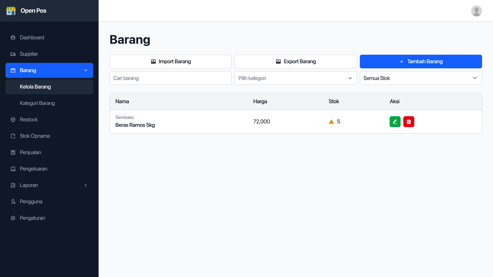
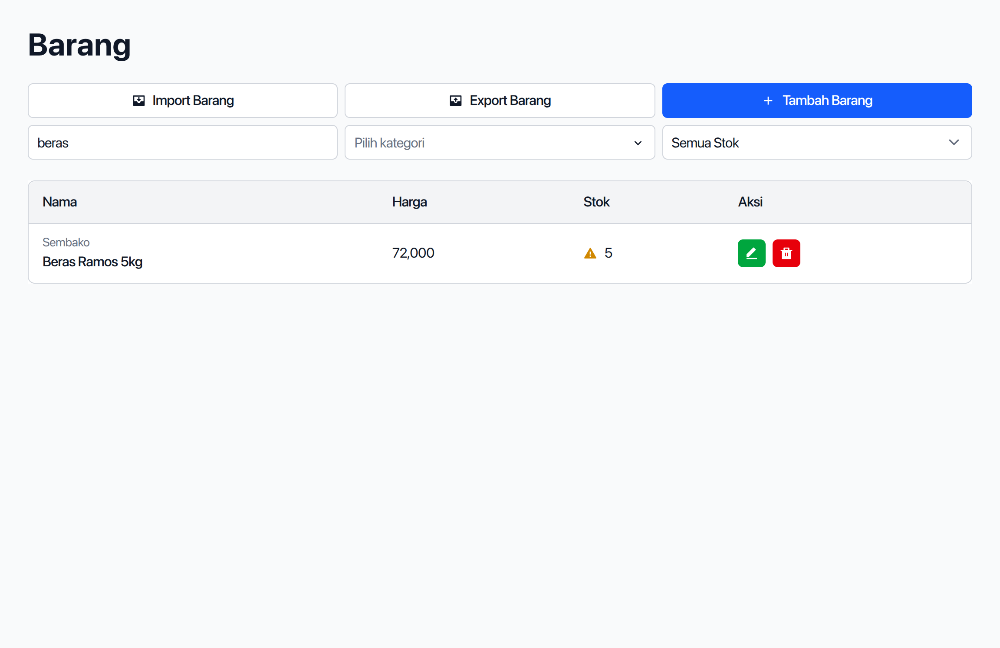
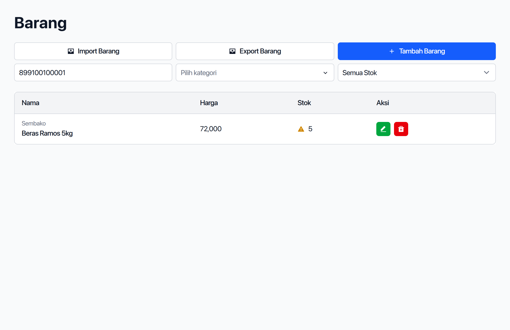
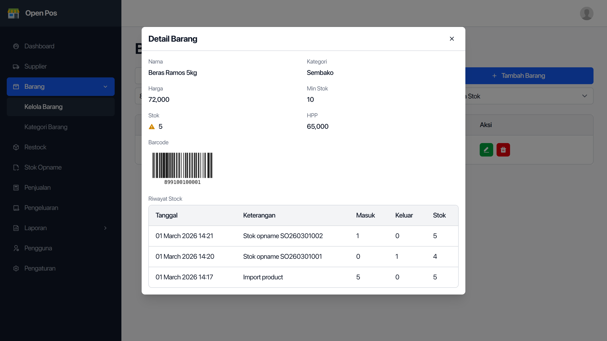

Untuk melihat daftar barang klik menu `Barang` di menu samping kiri.

Setelah diklik, halaman daftar barang akan terbuka dan muncul semua daftar barang dalam bentuk tabel.

## Mencari Barang

Untuk mencari barang, masukkan nama barang yang ingin dicari di kotak pencarian di atas tabel daftar barang.

### Mencari Barang Berdasarkan Barcode

Klik kotak pencarian di atas tabel daftar barang, masukkan kode barcode dengan keyboard atau dengan alat barcode scanner.

## Melihat Detail Barang

Untuk melihat detail barang, klik nama barang yang ingin dilihat pada tabel daftar barang.

Setelah diklik akan muncul _pop up_ yang menampilkan detail barang seperti:

- Nama
- Kategori
- Barcode
- Harga jual
- HPP
- dll

---

Lanjut, baca [cara menambahkan dan mengedit barang](/panduan/cara-menambah-dan-mengedit-barang).
