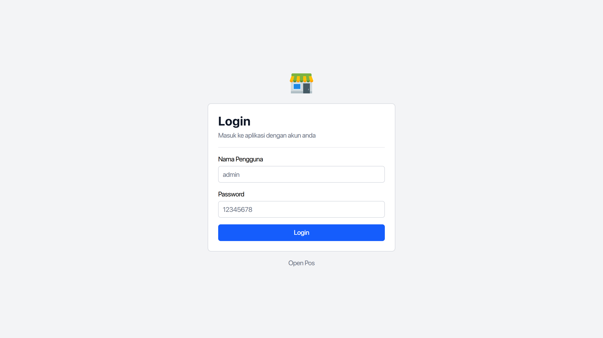

Aplikasi OpenPos dapat dibuka melalui browser dengan memasukkan alamat url toko Anda, misalnya:

```bash
www.warungburama.id
www.tokobarokah.id
```

- Alamat url toko akan didapatkan setelah Anda melakukan pembayaran.
- Alamat url toko bebas namanya, selama belum dipakai orang lain.
- Domain url toko bisa diganti selain `.id`, misal `.com`.
- Pastikan perangkat terhubung ke internet.

Setelah url toko dibuka di browser, akan muncul halaman login pengguna. Masukkan username dan password untuk bisa masuk ke aplikasi.



Lebih lanjut baca [cara login pengguna](/panduan/cara-login-pengguna).

## Offline Mode

Aplikasi OpenPos juga dapat diinstal ke komputer sehingga bisa digunakan secara offline, yaitu dengan memilih [paket custom](/#pricing).
