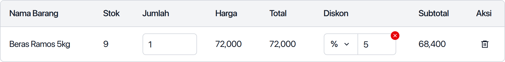
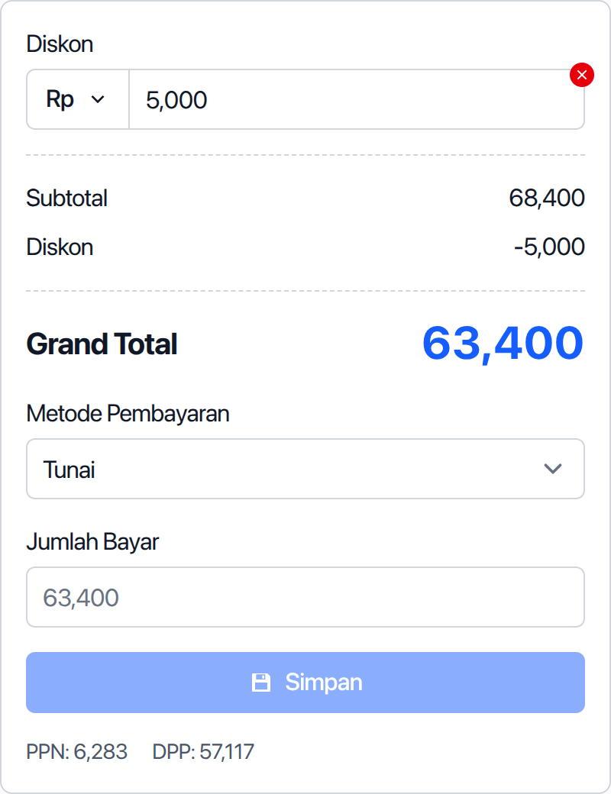

Diskon bisa ditambahkan ketika membuat penjualan. Ada dua jenis diskon:

1. Diskon per barang
2. Diskon total penjualan

Berkut panduannya masing-masing:

## Menambahkan Diskon Per Barang

Untuk menambahkan diskon per barang, masukkan barangnya terlebih dahulu ke barang yang akan dijual.

Setelah dimasukkan tekan tombol `Diskon` di barang yang ingin diberi diskon.

Pilih jenis diskon, bisa persen (%) atau angka bulat.

Masukkan nilai diskonnya.

Secara otomatis harga total per barang akan berkurang sesuai nilai diskon.

Untuk menghapus diskon klik ikon silang di diskon barang.

## Menambahkan Diskon Total Penjualan

Untuk menambahkan diskon total penjualan, klik tombol `Diskon` di atas total harga penjualan.

Pilih jenis diskon, bisa persen (%) atau angka bulat.

Masukkan nilai diskonnya.

Secara otomatis harga total penjualan akan berkurang sesuai nilai diskon.

Untuk menghapus diskon klik ikon silang di diskon.

---

Lanjut, [cara mengatur metode pembayaran pada penjualan](/panduan/cara-menambahkan-pembayaran-penjualan)
