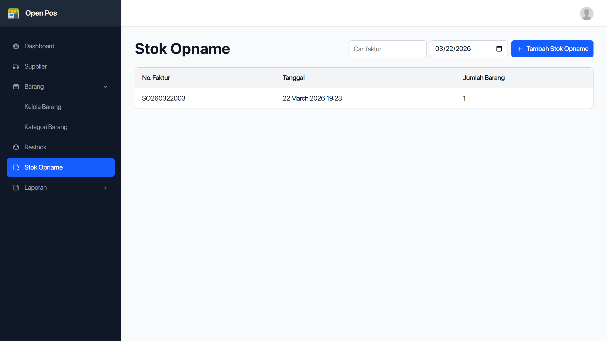
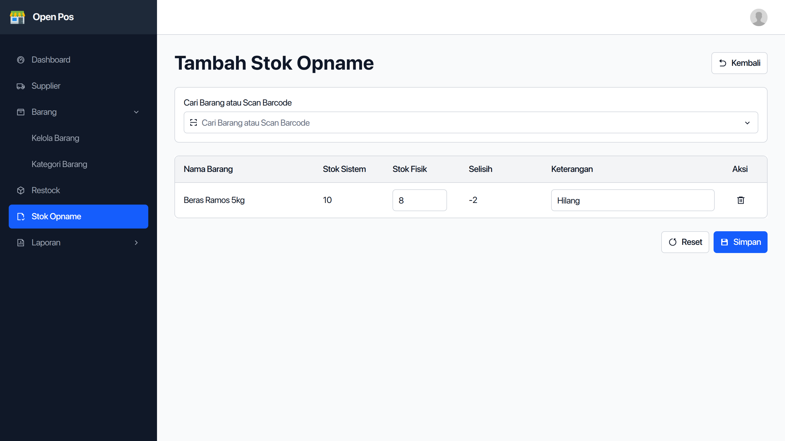

Stok opname adalah cara untuk menyesuaikan stok yang ada di aplikasi OpenPos dengan stok yang ada di toko.

Cara untuk membuat stok opname, pertama buka menu `Stok Opname` di menu samping kiri.

Setelah menu dibuka, akan tampil daftar stok opname yang pernah dibuat. Untuk membuat baru klik tombol `Tambah Stok Opname`.

Setelah tombol diklik, halaman tambah stok opname akan terbuka.

Klik kotak input pencarian barang untuk mencari barang yang ingin disesuaikan stoknya, bisa diketik namanya lalu dipilih, atau dengan scan barcode.

Barang yang dipilih akan masuk ke daftar barang yang akan distok opname. Setiap barang akan ditampilkan stok di sistem dan kotak untuk memasukkan stok yang ada di toko.

Setelah selesai semua, klik simpan.

Stok opname berhasil dibuat, cek [cara melihat stok barang](/panduan/cara-melihat-stok-barang) untuk melihat stok barang yang seharusnya sudah sesuai dengan stok yang ada di toko.
